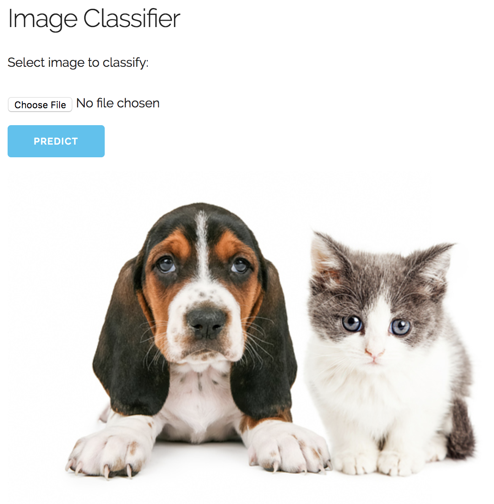

# Image Classification using Deep Neural Networks
### Classifier distinguishes images of dogs and cats.

Evidence suggests cats and dogs are particularly difficult to tell apart automatically. This model can distinguish the animals with 96% accuracy.

### Requirements
* Keras
* TensorFlow
* Numpy
* Flask

### Training (optional)
Any dataset can be used. Model was trained against Kaggle dataset:
https://www.kaggle.com/c/dogs-vs-cats

Create new folder **dataset/train** and two subfolders **dataset/train/cat** and **dataset/train/dog** to house training data
Create new folder **dataset/test** and two subfolders **dataset/test/cat** and **dataset/test/dog** to house validation data
Train network:
```
python train.py
```

### Run prediction:
Start Flask server
```
python predict.py
```
In browser, go to: 
```
http://127.0.0.1:5000/index
```
Select image to classify (file must exist in root)


